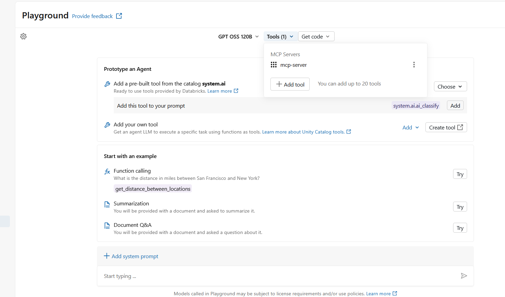
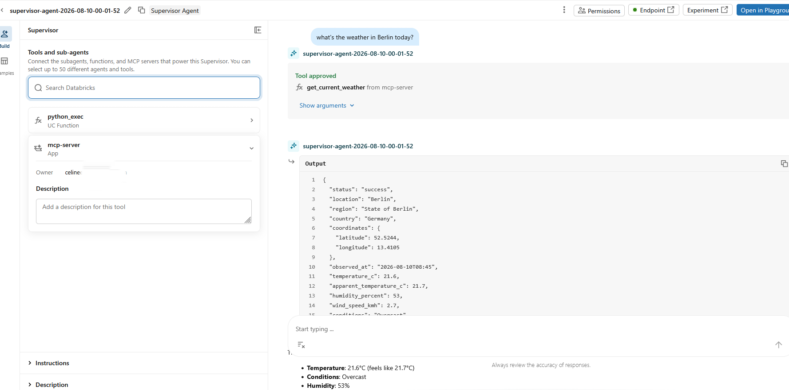
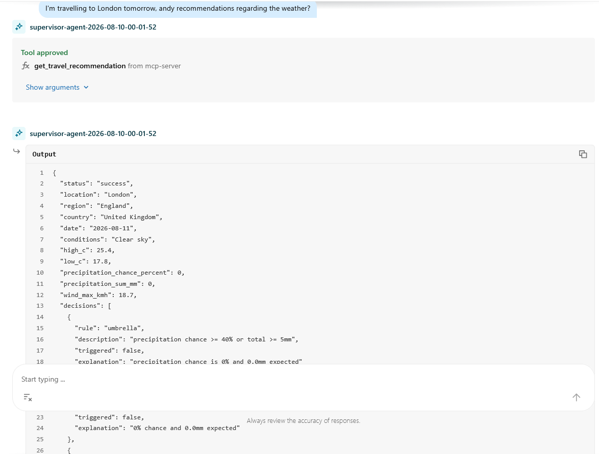
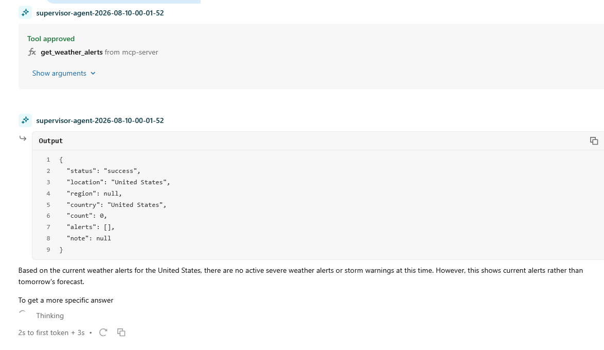

# The Rise of the AI Data Engineer - Homework Day 3

This repository contains my third homework project from **[The Rise of the AI Data Engineer](https://learn.dataexpert.io/)** bootcamp by Zach Wilson in August 2026, focusing on AI data engineering on Databricks with MCP (Model Context Protocol) servers and Agent Bricks agents.

## Projects

### Weather MCP Server + Agent Bricks Agent

A weather prediction system built with FastMCP and Agent Bricks that answers natural-language weather questions.



**Features:**
- Current weather conditions
- Multi-day forecasts (1-16 days)
- Travel recommendations (what to wear)
- Severe weather alerts (US only)
- Location comparison

**Example questions:**
- "What's the weather in Berlin today?"
- "What should I wear in London tomorrow?"
- "Is there any severe weather in the US right now?"

**Example interactions:**

*Weather query:*


*Travel recommendations:*


*Severe weather alerts:*


**Technology:**
- MCP server built with FastMCP, served over streamable HTTP
- 5 tools: `get_current_weather`, `get_forecast`, `get_travel_recommendation`, `get_weather_alerts`, `compare_weather`
- Weather data from Open-Meteo API (free, no API key required)
- Severe weather alerts from National Weather Service API (US only)
- Deployed as a Databricks App
- Agent Bricks agent with MCP tools integration

**📁 See the [`weather_mcp_server/`](weather_mcp_server/) folder for:**
- Complete setup and deployment instructions
- Architecture diagrams
- Example Q&As with real outputs
- Testing guidance
- System prompt for the Agent Bricks agent

### Alpaca Markets Paper-Trading MCP Server (Previous)

For the Alpaca Markets paper-trading project shown in the lecture by Zach Wilson, see [`README_ALPACA.md`](README_ALPACA.md).

## Repository Structure

```
homework-day3/
├── README.md                    # This file - main project overview
├── README_ALPACA.md             # from lecture: Alpaca Markets paper-trading project documentation
├── screenshots/                 # Demo screenshots for Weather MCP project
│   ├── agent_uses_my_mcp_server.png
│   ├── whats_the_weather_in_berlin_today.png
│   ├── travelling_to_london_tomorrow.png
│   └── weather_alterts_US.png
├── weather_mcp_server/         # Weather MCP server + agent (Homework 3)
│   ├── weather_mcp_server.py
│   ├── weather_broker.py
│   ├── agent_system_prompt.md
│   ├── app.yaml
│   ├── requirements.txt
│   └── README.md               # Full weather project documentation
├── mcp_server/                 # Alpaca MCP server
├── dashboard/                  # from lecture: Paper-trading dashboard
└── setup_secrets.py            # Secret configuration utility
```

## Quick Start

Each project folder contains its own README with detailed setup instructions, deployment steps, and usage examples.
